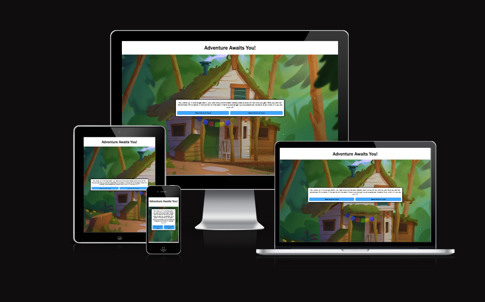
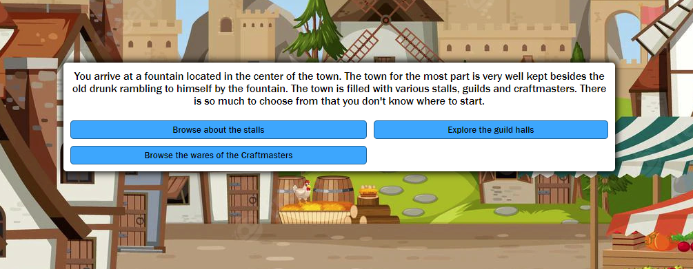
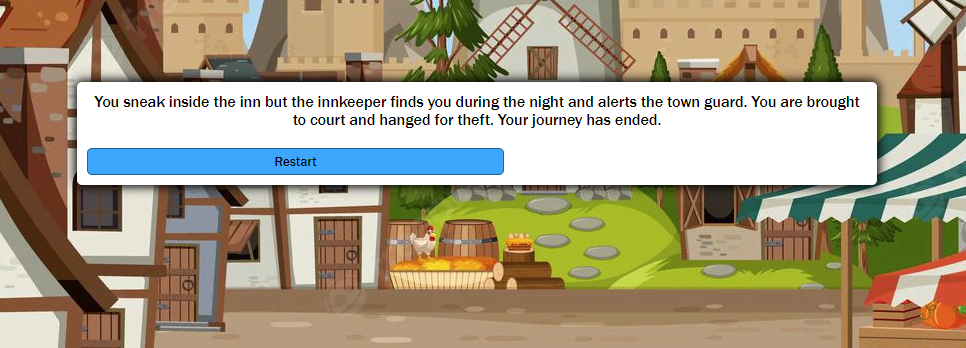
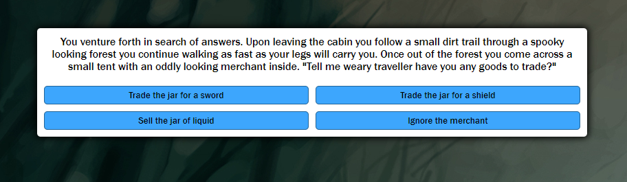
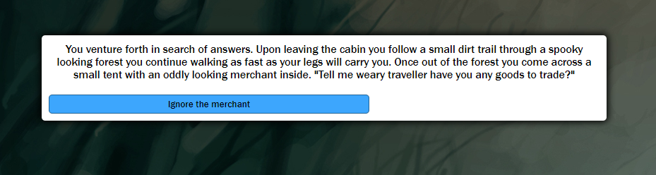
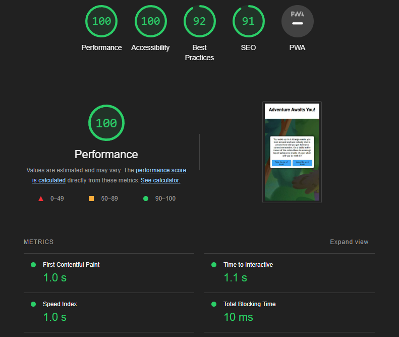
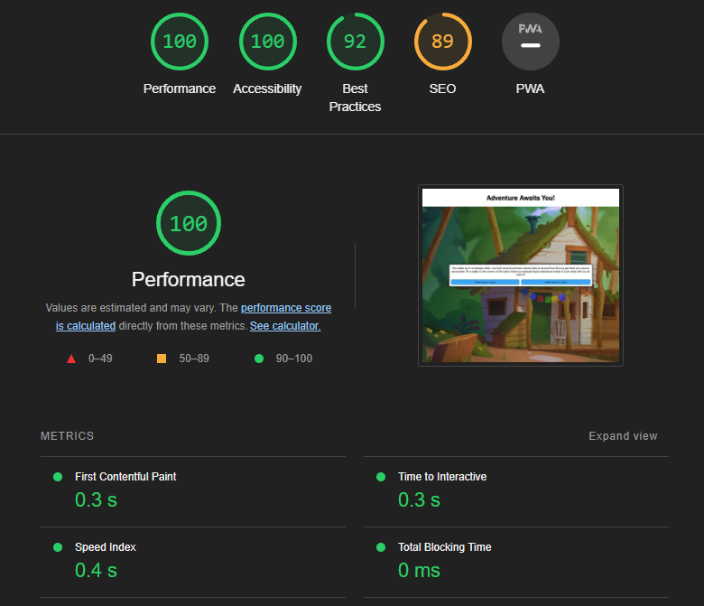

# Adventure Game

## Portfolio 2 Project: _Interactive Front-End Website_
This is a text-based choose your own adventure game designed for users of 13+ to play and enjoy.

## Demo
Find the live site here: [Adventure Awaits You](https://calumriot.github.io/Adventure-Game-JS/)

# Table of Contents

+ [User Experience](#user-experience)
+ [Overview](#overview)
+ [User Stories](#user-stories)
+ [Structure](#structure)
+ [Features](#features)
+ [Features Implemented](#features-implemented)
+ [Future Features](#future-features)
+ [Technologies Used](#technologies-used)
+ [Languages Used](#languages-used)
+ [Programmes & Libraries Used](#programmes-and-libraries-used)
+ [Testing](#testing)
+ [Validator Testing](#validator-testing)
+ [HTML Validator](#html-validator)
+ [CSS Validator](#css-validator)
+ [JavaScript Validator](#javascript-validator)
+ [Lighthouse Testing](#lighthouse-testing)
+ [Responsiveness Testing](#responsiveness-testing)
+ [Deployment](#deployment-via-github-pages)
+ [Credits](#credits)
+ [Acknowledgements](#acknowledgements)

***
***

# User Experience

## Overview
Text-Based Choose Your Own Adventure Games have been around sense before PC's & Computers were mainstream. They first gained notoriety from the popular "Choose Your Own Adventure" gamebooks. The concept was first created by Edward Packard for his novel gamebooks designed for children to enjoy. In the modern age Choose Your Own Adventure games have taken on many forms. From Popular Video Games such as Telltales "The Walking Dead" & "The Wolf Among Us" to interactive shows such as Netflix's "Black Mirror: Bandersnatch". It is clear that Choose Your Own Adventure Games have been around for sometime and have taken on many different forms. It is for these reasons that I choose to create my own. The game itself is easy to play, the user is presented with a statement/question and is given multiple answers to choose from. The answers that they choose shape how there story plays out and users can find themselves discovering various endings based on their own choices. The fact that multiple endings are possible encourages the user to replay the game in an attempt to get an alternative outcome increasing overall viewtime of the site itself.

## User Stories
* The user wants to play an online game with replay value that encourages them to come back.

* The user wants a simple text based game which isn't too complicated to play.

* The user wants a game that functions correctly.

* The user wants a pleasent and easy to read visual experience.

* The owner hopes to encourage users to come back and replay the game.

* The owner wants the game to be easily accessible to all users of any age or gaming background.

* The owner wants the game to be easy to understand and play.

## Structure
The website is designed with a 1 page layout to make it as simple for the user as possible with the structure of the website being the heading followed by the questions and answers area. The site has an image for a background which changes throughout the game to suit the setting of where the user has travelled too within the game itself. The text is a basic arial to allow it to be the same across all devices and browsers. The colour styling is a simple white and blue to allow the text to stand out easily making it easier for the user to read.

***
***

# Features

## Features Implemented

* The game allows you to choose multiple options allowing the user to create there own story. There is 12 possible endings for the user to find in the game which allows them to replay in order to discover all possible outcomes. 4 endings see the user find a happy ending as for the other 8 you'll just have to find out yourself ;)

* If the user discovers an ending a restart/congrats you won button will be given as the only option sending the user back to the start of the game.

* Depending on the choices the user makes some options maybe unavailable too them as they choose a previous option which has made later options not possible take for example the options displayed above. Both users have arrived at the same place within the game however for one user there is 4 options available and for the other only 1. This is due to choices they made previously which have had an effect on the possible choices they can make further within the game.

## Future Features

* A possible future feature to add could be a simple how to play page which is displayed prior to the game page. Although the game itself is designed to be quite simple to understand there can always be users who may find difficulty understanding what exactly it is there doing and this could result in the site itself losing users unnecessarily.

* Another possible feature that could be added is a display which shows how many endings the user has found. It is quite possible due to the multitude of endings that a user could play the game multiple times and still not discover an ending due to the select choices required to find it. For this reason having a display which shows all the endings that have been discovered would be useful to user who is hoping to discover them all.

***
***

# Technologies Used

## Languages Used

* HTML - For Base Site Layout

* CSS - To Style the Site & Game

* JavaScript - To Implement the logic of the game & to manipulate the HTML/CSS on the site.

## Programmes and Libraries Used

* Chrome Devtools - Used for debugging, Checking website on various screen sizes and to ensure code was functioning as expected.

* Github - Used for cloud storage of the project and to deploy the site.

* Gitpod - The IDE that was used preview and write the code for the site

* Lighthouse - Used for performing tests on sites speed, accessibility & search engine optimisation.

* CodeBeautify - Used to beautify code making it appear cleaner & easier to read.

***
***

# Testing

## Validator Testing

### HTML Validator

HTML Code was run through a validator and came back with zero errors.

### CSS Validator

CSS Code was run through a validator and came back with zero errors.

### JavaScript Validator

Javascript Code was run through a validator and missing semicolon errors came back. However due to these semicolons not being needed for the code to function as required this can be ignored.

### Lighthouse Testing

* Lighthouse Test results for performance on mobile devices:

* Lighthouse Test results for performance on desktop devices:

### Responsiveness Testing

As shown at the start of the readme the site itself displays similarly on desktop, mobile and tablet devices. A media query was required for mobile devices with a width under 400px due too overflowing of the header text.

***
***

## Deployment via GitHub Pages

The following steps detail how the project was deployed to GitHub pages:

1. Logged on to GitHub
2. Opened the repository **adventure-game-js**
3. Clicked on the **Settings** tab
4. Under **Code & Automation** section, click **Pages**
5. Under **Branch** select **main**
6. Under **Source** select **Deploy from a branch**
7. The site should now be deployed as a GitHub page. 

# Credits

* WebDevSimplified: I used WebDevSimplified's video on how to create a web text adventure game to help me create some of the functions required for my Javascript. - https://youtu.be/R1S_NhKkvGA

* W3Schools: I used W3Schools to help me when it came to writing some functions and also for my game-bg function to allow my background to changed based on which textNode the user was at.

* Slack: I used my slack channels to assist me with some errors that I encountered with my JavaScript when designing the game.

## Acknowledgements

I would like to thank my tutor Irene for helping to keep me motivated by checking in on my project progress. I would also like to thank my classmates at Kerry ETB as whenever I or they have any issues with learning code we always assist each other by giving suggestions on what could be done to fix bugs that we encounter.